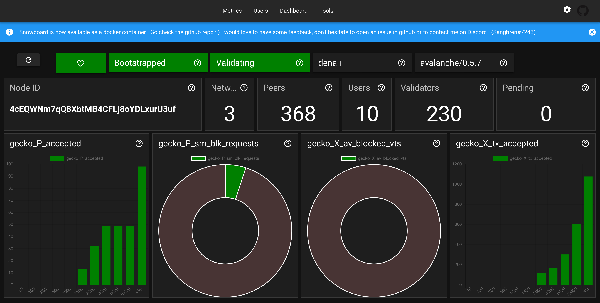
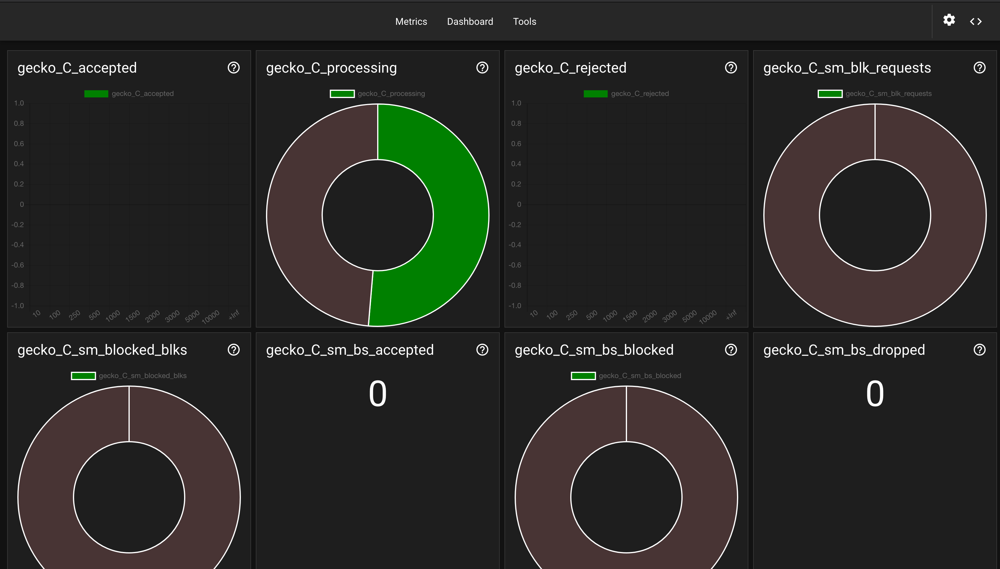
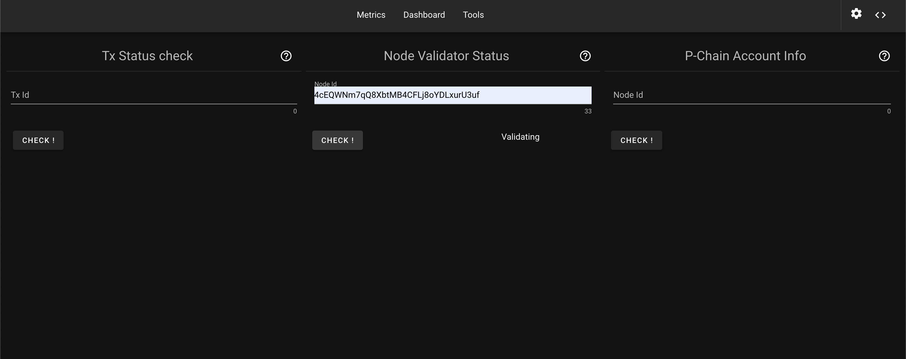

## NOTE

I have no time to maintain this right now but am still planning to do so ! 

# Snowboard

Snowboard is a Vue.js frontend for [Gecko](https://github.com/ava-labs/gecko), the official Go implementation of an AVA node.

The goal of Snowboard is to provide an easy way to visualize and interact with a Gecko node .

Why Snowboard ? Well ... I had no inspiration, so I just picked something related to snow/avalanche/slopes and that ended up
with **board** because it's a kind of dash**board** . Voila . :p

If you want to test, it's [here](https://snowboard-ava.herokuapp.com/)








## Installation

### Gecko
Since Snowboard is a dashboard for Gecko ... well you'll need a Gecko node in a way or another .

You can follow [this guide](https://docs.avax.network/v1.0/en/quickstart/ava-getting-started/) to have one running .

Or you can use [avash](https://docs.avax.network/v1.0/en/tools/avash/) (Check this out, pretty awesome :) )

### Snowboard 

```bash
yarn
yarn serve
```

### Docker

I created a first version of a Docker container for Snowboard .

Docker compose way for a node running locally :
````shell script
  snowboard:
    container_name: snowboard
    hostname: snowboard
    image: snowboard/dashboard
    restart: unless-stopped
    volumes:
      - /var/run/docker.sock:/var/run/docker.sock
    environment:
      - VUE_APP_SNWBRD_NODE_HOST=localhost
      - VUE_APP_SNWBRD_NODE_PROTOCOL=http
      - VUE_APP_SNWBRD_NODE_CHAIN_ID=X
      - VUE_APP_SNWBRD_NODE_PORT=9650
      - VUE_APP_SNWBRD_NODE_NETWORK_ID=3
      - VUE_APP_SNWBRD_DISABLED_KEYSTORE_CREATION=true
````

Docker command for a node running locally :
````shell script
  docker run -p 5978:80 --rm --name snowboard  \
      --env "VUE_APP_SNWBRD_NODE_HOST=localhost" \
      --env "VUE_APP_SNWBRD_NODE_PROTOCOL=http" \
      --env "VUE_APP_SNWBRD_NODE_CHAIN_ID=X" \
      --env "VUE_APP_SNWBRD_NODE_PORT=9650" \
      --env "VUE_APP_SNWBRD_NODE_NETWORK_ID=3" \
      --env "VUE_APP_SNWBRD_DISABLED_KEYSTORE_CREATION=true" \
      snowboard/dashboard
````

## Contributing
Pull requests are welcome. For major changes, please open an issue first to discuss what you would like to change.

Please make sure to update tests as appropriate.

## License
[MIT](https://choosealicense.com/licenses/mit/)
